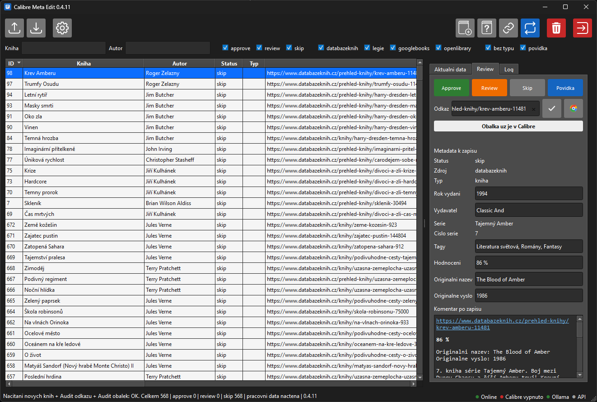

# Calibre Meta Edit

> **TL;DR (English):** Windows desktop app (Python/PySide6) for reviewing and
> fixing book metadata in a [Calibre](https://calibre-ebook.com/) library —
> matches books against multiple sources, fetches covers, imports EPUB/other
> formats, and writes back safely (auto-backup, nothing saved without
> confirmation). AI-assisted title/author detection via local Ollama or a
> cloud LLM. 741 unit tests. Built for the Czech book market (UI and metadata
> sources are Czech — [databazeknih.cz](https://databazeknih.cz),
> [Legie.info](https://legie.info)), so the rest of this README stays in Czech.

Desktopová appka (Windows, Python/Qt) na kontrolu a doplnění metadat knih v
knihovně [Calibre](https://calibre-ebook.com/). Načte knihy, dohledá k nim
metadata a obálky z více zdrojů, umí importovat EPUB (a další formáty) a bezpečně
zapsat výsledek zpět do Calibre. Detekci názvu a autora umí podpořit AI (lokální
Ollama nebo cloud).



## Co umí

- Načíst knihy z Calibre knihovny a projít je ke schválení.
- Audit odkazů/zdrojů (databazeknih, Legie, Google Books, Open Library...).
- Dohledat a doplnit obálky.
- Import knih (EPUB a další) do Calibre přes jedno sjednocené okno.
- AI detekce názvu/autora ze začátku knihy (Ollama nebo cloud, volitelné).
- Bezpečný zápis: záloha `metadata.db` před importem, nic se nezapíše bez potvrzení.

## Požadavky

- **Calibre** nainstalované (appka volá `calibredb`): https://calibre-ebook.com/download
- Pro AI (volitelné) jedno z:
  - **Ollama** (lokální, doporučeno): https://ollama.com/download , pak `ollama pull llama3.1:8b`
  - **Cloud**: soubor `.env` vedle `CalibreMetaEdit.exe` s `ANTHROPIC_API_KEY=...`
    nebo `OPENAI_API_KEY=...`

Bez AI appka funguje taky, jen je detekce názvu/autora méně přesná.

## Instalace (hotový exe)

1. Stáhni `CalibreMetaEdit-*.zip` ze [záložky Releases](https://github.com/senojed/calibre-meta-edit/releases).
2. Rozbal (ideálně do Dokumentů, ne do Program Files).
3. Spusť `CalibreMetaEdit.exe`.
4. Windows ukáže modrou ceduli SmartScreen (appka není podepsaná):
   **Další informace → Přesto spustit**.
5. Po startu si appka sama zkontroluje, co chybí (Calibre, Ollama, model), a napoví.

Nastavení, zálohy a `.env` si appka drží ve složce vedle exe.

## Spuštění ze zdroje (vývoj)

```powershell
pip install pyside6
python calibre_meta_qt.py
```

## Build vlastního exe

Viz [docs/BUILD.md](docs/BUILD.md) (PyInstaller onedir).

## Licence

[GNU GPLv3](LICENSE).
